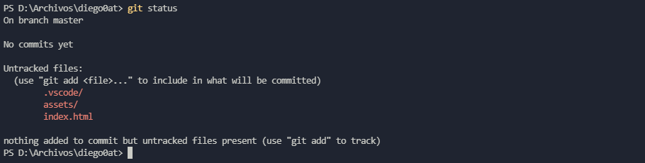
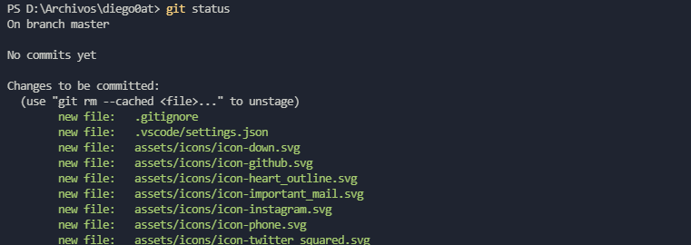

summary: Git básico en consola.
id: basic-git-console
categories: web
tags: vslive
status: Published 
authors: diego0at
Feedback Link: https://diego0at.github.io/

# Git consola básico

## ¿Qué es lo que aremos?
Duration: 0:02:00

Con [Git Instalado][1], podemos empezar a comenzar un repositorio localmente y empezar a utilizar algunos comandos básicos para gestionar nuestros repositorios y archivos, así que vamos a ello. 

Negative
: Para los ejercicios utilizaremos el proyecto de portafolio jaume, el cual lo puedes encontrar en la pagina [leonidasesteban.com](https://leonidasesteban.com/), o puedes utilizar cualquiera proyecto de preferencia, es más, hasta puedes trabajar con un archivos realizado simples modificaciones.

### Comando a utilizar

Antes de empezar quiero enumerar los comandos y banderas que vamos a utilizar, esto por si quiero recordar algún comando, pueda visualizarlo rápidamente.

```git
Git add remote origine *dirección*
Git init
Git commit -m 'comentario'
```
[1]: #

**Recursos:** 
* Markdown del codelab para enviar solicitud de cambios: [modificar](https://www.marcd.dev/codelab-4-codelab)
* Introducción a Markdown: [modificar](https://github.com/Mrc0113/codelab-4-codelab/blob/master/codelab.md)
* [Solicitudes(https://github.com/googlecodelabs/tools) - Enviar solicitudes de cambios en Github

## Configuración inicial
Duration: 0:02:00

Dentro de las configuraciones de Git, podemos encontrar la **identidad** y el editor de texto, en esta ocasión vamos a configurar la identidad, ya que es lo primero que debemos hacer después de instalar Git.

Para iniciar, abrimos cualquier consola de preferencia. Una vez tengamos nuestra consola, vamos a proceder a configurar Git.

### Identidad

- `git config --global user.name "miNombre"` 

- `git config --global user.email miEmail.email.com`

Como son nuestros primeros comandos ingresados vamos a mencionar algunas cosas:

 `git` Inicia todos los comandos que podamos ingresar. 

`--global` Utilizamos esta bandera para que las configuraciones sean aplicadas de manera global y no a nivel de proyecto.

Positive
: Los comandos de configuración solo es necesario relanzarlo una vez, si deseamos modificarlos simplemente volvemos a ejecutar los comandos de configuración.

### Comprobando la configuración

- `git config --list`

Si deseas una consulta mas especifica:

- `git config user.name`

## Iniciando repositorio
Duration: 0:02:00

Para iniciar nuestro repositorio localmente, creamos y nos dirigimos a al directorio donde vayamos a trabajar nuestro proyecto.

Podemos realizar este trabajo mediante cmd.

```
cd D:\user\juan\Documentos
mkdir miProyecto 
cd miProyecto
```

Una vez creado y ubicados en el proyecto en la terminal, procedemos a iniciar nuestro repositorio con `Git init`

```Git
Git init
```

`Git init` inicia nuestro repositorio. Esto creara una carpeta oculta  `.init`  la cual tiene los archivos necesarios para que el repositorio funcione correctamente, asi que no se te ocurra borrarla.

### Estado del repositorio

Ahora que hemos iniciado nuestro repositorio vamos a comprobar su estado, para ello utilizamos `Git status`.

```Git
Git status
```

Como no hemos creado ninguna archivo, nos dirá que aún no hay confirmaciones. Esto está bien, así que vamos a empezar a agregar archivos, en mi caso voy a agregar mi proyecto, pero para fines de pruebas puedes agregar cualquier archivo de preferencia  de texto.

Una vez agregados los archivos, el estado de git nos indica en color rojo que tenemos archivos pendientes en nuestro repositorio.




## Agregando archivos

### Agregando archivos

Los archivos pendientes en nuestro repositorio necesitan ser confirmados, para agregar archivos a nuestro repositorio utilizamos `Git add`

`Git add` nos permite agregar archivos de diferentes maneras, podemos especificar el nombre del archivo que queremos agregar, también el tipo de archivos o directamente todos los archivos

#### Agregando por nombre

Simplemente mencionamos el nombre del archivo en especifico, el cual deseamos agregar

```Git
Git add index.html
```

#### Agregando por extension

En lugar del nombre, anteponemos * y seguido mencionamos el tipo de extensión que queremos agregar

```Git
Git add *.html
```

#### Agregando todos los archivos

Para agregar todos los archivos simplemente agregamos un punto.

```Git
Git add .
```

#### Resultado

Después de agregar todos los archivos pendientes, utilizamos `Git status` para verificar su estado.



Cuando modifiquemos un archivo, este debe ser agregado nuevamente con `git add`.

## Guardando versiones


